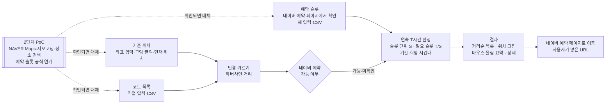

# 예약 가능한 테니스 코트 조회 — 프로젝트 기획서

| 항목 | 내용 |
|---|---|
| 리포 | data09-20 |
| 제출자 | 조윤제 |
| 직무·소속 | 제출 자료에 명시되지 않음 (data09-06 과 같은 수강생 — 진동·소음 시험·분석 업무로 보임(가정)). 이 과제는 업무 밖 생활 편의 주제입니다 |
| 과정 | 현장 데이터 디지털화 전문가과정 1차수 |
| 작성일 | 2026-09-29 |
| 문서 상태 | 초안 v0.1 — 수강생 제출 기획서(V1.0, 20장·표 39개) 기반 |

이 문서는 제출자가 패들릿에 올린 「예약 가능한 테니스 코트 조회」(2026-09-29)와 첨부 「테니스 코트 예약 가능 시간 자동 조회 시스템 개발 기획서」 V1.0(`docs/source/테니스코트_예약조회_개발기획서_V1.0.docx`)을 과정 기획서 형식(10장)으로 다시 정리한 것입니다. 원본 기획서의 장 번호는 「원본 n장」으로 적습니다.

## 1. 추진 배경과 현안

- 테니스 코트를 예약하려면 **여러 코트를 하나씩 검색하고, 날짜·시간을 반복해서 확인**해야 합니다(원본 표 4).
- 사용자가 원하는 것은 「내 위치에서 가까운 코트」가 아니라 **「원하는 위치·날짜·시간 조건을 만족하면서 실제로 연속 2시간 이상 예약 가능한 코트」를 한 번에 찾는 것**입니다(원본 16장).
- 코트 대부분이 **네이버 예약**으로 예약을 받는 것으로 보고, 최종 예약은 네이버 예약 페이지에서 하도록 연결합니다(원본 17장 설계 원칙).
- 원본 기획서 스스로 **가장 큰 위험**을 짚었습니다: 코트 위치·기본 정보와 달리, **날짜·시간별 네이버 예약 잔여 슬롯을 외부 서비스가 가져올 수 있는지는 검증이 필요**하며, 공식 연계 경로가 없으면 자동화 범위를 줄여야 합니다(원본 12·13·20장).

## 2. 목표

### 2.1 최종 목표 (원본 기획서)

- 기준 주소·검색 반경·기간·희망 시간·최소 연속 이용시간을 넣으면, **네이버 예약이 가능한 테니스 코트 중 조건을 만족하는 코트와 시간대를 자동으로 찾아 지도에 보여 주는** 웹 서비스
- 지도 Marker 에 마우스를 올리면 요약, 누르면 상세와 네이버 예약 페이지 연결

### 2.2 1차 개발 목표 (이 리포)

- 원본 13장 검증 단계 중 **⑤ 연속시간 판정을 완성**합니다 — 슬롯 단위 S, 필요 연속 슬롯 T/S, 기간·희망 시간대 적용. 이 부분은 데이터를 어디서 받든 그대로 쓰는 핵심 로직입니다.
- ①~④(좌표 변환·시설 검색·예약 여부·예약 슬롯)는 **공식 연계가 확인되기 전까지 사용자 입력으로 대신**합니다. 네이버 예약 화면을 긁어오거나 비공식 내부 호출을 하지 않습니다(원본 14장 결론).
- 결과를 **거리순 목록 + 기준점 기준 위치 그림**으로 보여 주고, Marker 마우스 올림 요약·클릭 상세·네이버 예약 링크를 구현합니다.
- 네이버 지도·예약 연계는 **2단계 PoC** 로 체크리스트화합니다(8장).

## 3. 보유 데이터

| 데이터 | 형태 | 규모·주기 | 비고 |
|---|---|---|---|
| 코트 정보 | 코트명·주소·위도/경도·전화번호·네이버 플레이스/예약 URL·예약 가능 여부·실내/실외·코트 수·운영시간 (원본 11.1 Court) | 미상 — 기준 위치 반경 안의 코트 | 공개 시설 정보. 원본은 네이버 지도/플레이스 검색으로 얻는 것을 전제 |
| 예약 슬롯 | 코트·날짜·슬롯 시작/종료·예약 가능 여부·최종 갱신 시각 (원본 11.3 Availability) | 코트 × 날짜 × 슬롯(30분·1시간 등) | **확보 방법 미정 — 원본 12~14장의 선행 게이트** |
| 검색 조건 | 기준 주소·좌표·반경·기간·희망 시간·최소 연속시간 (원본 11.2 SearchCondition) | 검색할 때마다 | 최근 조건 유지(원본 기능 8) |

제출 자료에는 실제 코트 목록이나 예약 슬롯 데이터가 없습니다. 원본 5.2·5.3 표의 예시(10/01~10/04 가능 시간, 30분 슬롯 ○○○○×)를 검증용 예시 데이터로 씁니다.

## 4. 해결 방안 개요

| 단계 | 내용 |
|---|---|
| 수집 | 1단계: 사용자가 코트 정보와, 네이버 예약 페이지에서 확인한 가능 시간을 입력(표 클릭·CSV). 2단계: 공식 API·제휴 연계가 확인되면 그 경로로 대체 |
| 정리 | 가능 시간을 코트의 슬롯 단위로 나누고, 「미입력」과 「확인했고 가능 없음」을 구분해 저장 |
| 분석 | 반경 안 코트만 골라, 날짜마다 희망 시간대 안에서 끊기지 않고 T시간 이상 이어지는 가능 슬롯을 찾음 |
| 산출물 | 거리순 결과 목록(상태·가능 시간·최대 연속), 위치 그림, 날짜별 상세(시작 가능 시각), 결과 CSV |

## 5. 주요 기능

원본 2장 기능 1~8 과 18장 요구사항(FR-01~10)을 1단계 기준으로 다시 적었습니다.

| 기능 | 설명 | 우선순위 |
|---|---|---|
| 기준 위치 (FR-01) | 위도·경도 직접 입력, 「위도, 경도」 한 줄 붙여 넣기, 위치 그림 클릭, 등록한 코트 위치, 브라우저 현재 위치. **주소 → 좌표(지오코딩)는 2단계** | MVP |
| 검색 반경 (FR-02) | 1·2·5·10 km 또는 직접 입력, 하버사인 거리로 반경 안 코트만 | MVP |
| 코트 목록 (FR-03) | 코트 직접 입력·고치기·지우기, CSV 가져오기(원본 11.1 영문 필드명도 인식)·내보내기. **장소 검색 API 로 자동 찾기는 2단계** | MVP |
| 네이버 예약 필터 (FR-04) | 코트마다 가능/불가/미확인, 「네이버 예약 가능 시설만」 거르기 | MVP |
| 기간·희망 시간 (FR-05·06) | 시작일~종료일(최대 62일), 희망 시작·종료 시각(같은 날 안) | MVP |
| 연속 예약 판정 (FR-07) | 최소 연속 이용시간 1~4시간(30분 간격), 슬롯 단위 S 는 코트마다, 필요 연속 슬롯 = T/S(올림). 희망 시간대를 걸쳐 나가는 슬롯은 세지 않음. 날짜 넘김은 이어 붙이지 않음 | MVP |
| 예약 슬롯 입력 | 코트·날짜별 슬롯 표 클릭(○/×), 「18:00~19:00, 20:00~22:00」 한 줄 입력, CSV 두 형식(하루 한 줄 / 슬롯 한 줄), 「가능 없음」과 「미입력」 구분, 최종 갱신 시각 기록 | MVP (1단계 대체) |
| 결과 표시 (FR-08) | 좌 목록(거리순, 조건 만족 먼저) · 우 위치 그림(기준점 대비 방향·거리, 반경 원, 축척). 상태 ● 조건 만족 / ○ 미충족 / 점선 ○ 슬롯 미입력 / × 네이버 예약 불가 (원본 6장) | MVP |
| 마우스 올림 요약 (FR-09) | 코트명·거리·네이버 예약·가능 시간·최대 연속·예약 링크 (원본 7장 Popup), 목록 ↔ 표시 서로 강조 (원본 8장) | MVP |
| 네이버 예약 연결 (FR-10) | 사용자가 넣은 예약 URL(http·https 만). 없으면 네이버 지도 이름 검색 링크 | MVP |
| 검색 조건 유지 (기능 8) | 마지막 조건을 브라우저에 저장해 다음에 그대로 | MVP |
| 지도 표시 (NAVER Maps) | 실제 지도 위 Marker | 2단계 (API 키·약관 확인 후) |
| 예약 슬롯 자동 수집 | 공식 API·제휴 연계로 잔여 슬롯 갱신, 캐시 | 2단계 게이트 (확인되면) |

## 6. 기대 산출물

1. **예약 가능 코트 조회 도구(브라우저, 1단계)** — 조건 입력, 연속 예약 판정, 거리순 목록·위치 그림·상세, 코트·슬롯 입력과 CSV, 백업·복원
2. **연속 예약 판정 로직과 테스트** — 원본 5.2·5.3·5.4 표를 그대로 검증하는 테스트 포함. 2단계에서 데이터 공급원만 바꿔 재사용
3. **DB 스키마 초안** — `supabase/schema.sql`(원본 11장 표 3개, RLS)
4. **2단계 PoC 체크리스트** — 8장, 도구의 「네이버 연계 준비」 화면

## 7. 기술 구성

| 과정 도구 | 이 프로젝트에서 쓰는 곳 |
|---|---|
| DAY1 암묵지 자산화·전략기획 | 「어느 코트는 몇 시에 잘 빈다」 같은 경험을 코트 목록·슬롯 기록으로 남기기 |
| DAY2 코랩(Python)·바이브코딩 | 연속 예약 판정·반경 거르기 화면 제작 — 이 프로젝트의 중심 |
| DAY3 멀티모달 비정형 정보화 | (선택) 예약 페이지 화면 캡처에서 가능 시간 읽어 내기 — 사용자가 직접 찍은 캡처에 한함 |
| DAY4 RAG (Dify, NotebookLM) | 해당 없음 |
| DAY5 Make 자동화 | (2단계, 공식 연계가 있을 때) 정기 조회·알림 |

**개발 형태(1단계)**

- **설치 없이 브라우저에서 도는 정적 웹 도구**입니다. 서버·API 키가 없고, 데이터는 브라우저(localStorage)와 백업 파일에만 둡니다. `index.html` 을 더블클릭해도 열립니다.
- **외부 지도 서비스를 부르지 않습니다.** NAVER Maps 는 API 키와 서비스 URL 등록이 필요하고, 공개 리포에 키를 둘 수 없어 1단계에서는 기준점 대비 방향·거리를 그린 SVG 위치 그림으로 대신합니다. 지도 타일(OSM 등)도 외부 요청이라 넣지 않았습니다.
- **네이버 예약 데이터는 자동으로 가져오지 않습니다.** 원본 14장 표에서 「브라우저 자동화」「비공식 내부 API 호출」은 약관·차단·유지보수 위험으로 장기 운영에 부적합하다고 정리했으므로 그 결론을 따릅니다.
- 2단계에서 서버가 생기면 `supabase/schema.sql` 의 표 구조를 씁니다(본인 Supabase 프로젝트, 접두사 없음).

## 8. 개발 단계

### 1단계 — 지금 바로 개발 가능한 부분 (완료, 2026-09-29)

원본 13장 검증 단계별로, 공식 연계 없이 할 수 있는 만큼 만들었습니다.

| 검증 단계 (원본 13장) | 1단계에서 한 것 |
|---|---|
| ① 좌표 변환 | 좌표 직접 입력·한 줄 붙여 넣기(경도·위도 순서도 바로잡음)·위치 그림 클릭·현재 위치. 주소 검색은 2단계 |
| ② 시설 검색 | 코트 목록 직접 입력·CSV + 하버사인 반경 거르기 |
| ③ 예약 여부 | 코트마다 가능/불가/미확인 입력, 필터 |
| ④ 예약 슬롯 | 네이버 예약 페이지에서 확인한 값을 표 클릭·한 줄·CSV 로 입력, 최종 갱신 시각 기록 |
| ⑤ 연속시간 판정 | **완료** — 원본 5.2 표 4일치, 5.3 표(30분 ○○○○×), 5.4 표(T/S)를 테스트로 확인 |

- 시험용 예시 데이터: 가상 코트 7곳(반경 밖 1곳, 예약 불가 1곳, 슬롯 미입력 1곳 포함), 10/01~10/15 슬롯. 「예시 테니스장 A」의 10/01~10/04 는 원본 5.2 표, 「B」의 10/01 은 원본 5.3 표 그대로입니다.

### 2단계 — 네이버 지도·예약 연계 PoC (착수 게이트)

원본 19장 「2. API/데이터 PoC」와 표 38 권장 순서(① → ⑤)를 따르며, 아래를 모두 확인한 뒤 범위를 확정합니다.

- [ ] **공식 API 범위** — 네이버 개발자센터·NAVER Cloud 에서 쓸 수 있는 것: 지도 표시(Maps), 지오코딩(주소 → 좌표), 지역(장소) 검색으로 「테니스장」 찾기. 날짜·시간별 **예약 잔여 슬롯을 주는 공개 API 가 있는지**
- [ ] **이용약관** — 검색 결과를 저장·가공·다시 보여 줘도 되는지, 지도 위에 다른 데이터를 겹쳐 그려도 되는지, 호출량 제한·요금
- [ ] **키 발급·보관** — 지도용 Client ID 는 서비스 URL(도메인) 등록 필요. 서버용 Client Secret 은 공개 리포·브라우저 코드에 넣지 않고 서버(Edge Function 등)에만 둠
- [ ] **제휴·사업자 연계** — 코트 운영자가 네이버 스마트플레이스에서 예약 데이터를 공유할 수 있는지(원본 14장 「제휴/사업자 연계」 = 안정적 운영에 적합)
- [ ] **게이트 판정** — ④가 확보되면 슬롯 자동 갱신(캐시·최종 갱신 시각)을 붙이고, 확보되지 않으면 원본 13장 게이트대로 「사용자 확인 입력 + 네이버 예약 페이지 연결」을 유지
- [ ] 확보된 경로로 ①~③ 대체: 주소 검색 → 좌표, 반경 안 테니스장 자동 목록, 예약 제공 여부 표시, NAVER Maps 지도 위 Marker

### 3단계

- 원본 15장 Phase 5 — 데이터 갱신 주기·캐시·검색 성능, 검색 조건 여러 개 저장(즐겨찾기), 알림(빈 시간이 생기면 알려 주기 — 공식 연계가 있을 때만)
- 여러 기기에서 쓰려면 `supabase/schema.sql` 로 로그인·동기화

## 9. 기대 효과

- **반복 확인 시간 절감** — 여러 코트·여러 날짜를 하나씩 열어 보던 일을, 확인한 슬롯만 적어 두면 조건에 맞는 날·시간을 한 번에 봅니다.
- **정확한 판정** — 「30분 슬롯 4개가 끊기지 않아야 2시간」 같은 규칙을 사람이 눈으로 세지 않아도 됩니다. 시작 가능 시각까지 알려 줍니다.
- **위험을 먼저 확인** — 가장 불확실한 예약 데이터 연계를 게이트로 두고, 연계와 무관한 판정 로직을 먼저 완성해 2단계에서 그대로 씁니다.

제출 자료에 정량 목표가 없어 수치를 적지 않습니다.

## 10. 확인 필요 사항

**데이터**

1. 실제로 자주 쓰는 코트 목록(이름·위치) 몇 곳과, 그 코트들의 네이버 예약 **슬롯 단위**(30분인지 1시간인지, 코트마다 다른지)
2. 한 코트에 코트면이 여러 개일 때 네이버 예약이 **면마다 따로** 슬롯을 여는지 — 그렇다면 「어느 면이든 연속 2시간」인지 「같은 면에서 연속 2시간」인지 (1단계는 코트 단위로 봄 — 가정)
3. 네이버 예약에서 가능 시간을 어떤 모양으로 보는지(캡처 1장이면 충분) — 1단계 입력 방식을 맞추기 위해

**조건·화면**

4. 희망 시간이 **자정을 넘는 경우**(예: 22:00~01:00)가 필요한지 — 1단계는 같은 날 안만
5. 요일 거르기(주말만 등)나 「같은 날 여러 코트 중 가장 가까운 곳」 같은 추가 조건이 필요한지
6. 기준 위치를 주소로 넣는 것이 꼭 필요한지(2단계 지오코딩 API 키 필요) — 좌표·그림 클릭·현재 위치로 충분한지

**2단계 연계**

7. 네이버 개발자센터·NAVER Cloud 계정이 있는지, API 키를 직접 발급해 볼 수 있는지
8. 이 도구를 본인만 쓰는지, 다른 사람에게도 공개할 서비스인지 — 공개 서비스라면 약관 검토 범위가 달라짐

## 부록. 제출 원문 요약

| 출처 | 파일·게시물 | 내용 |
|---|---|---|
| 패들릿 게시물 (2026-09-29T02:12) | 「예약 가능한 테니스 코트 조회」 — `docs/source/패들릿_제출_원문.md` | 기획서를 링크로 첨부, 제출자 조윤제 |
| 첨부 기획서 | `docs/source/테니스코트_예약조회_개발기획서_V1.0.docx` | V1.0, 20장 + 부록 A, 표 39개. 개발 개요·주요 기능 8가지·입력 조건·연속 2시간 판정(5.2~5.4 표)·지도 Marker 상태·Popup·화면 구성·데이터 처리 구조·DB 설계(Court·SearchCondition·Availability)·네이버 연계 검토·기술 검증 5단계와 착수 게이트·데이터 확보 방식 5가지 비교·MVP Phase 1~5·사용자 시나리오·권장 구조·요구사항 FR-01~10·일정·결론·참고 링크 |
